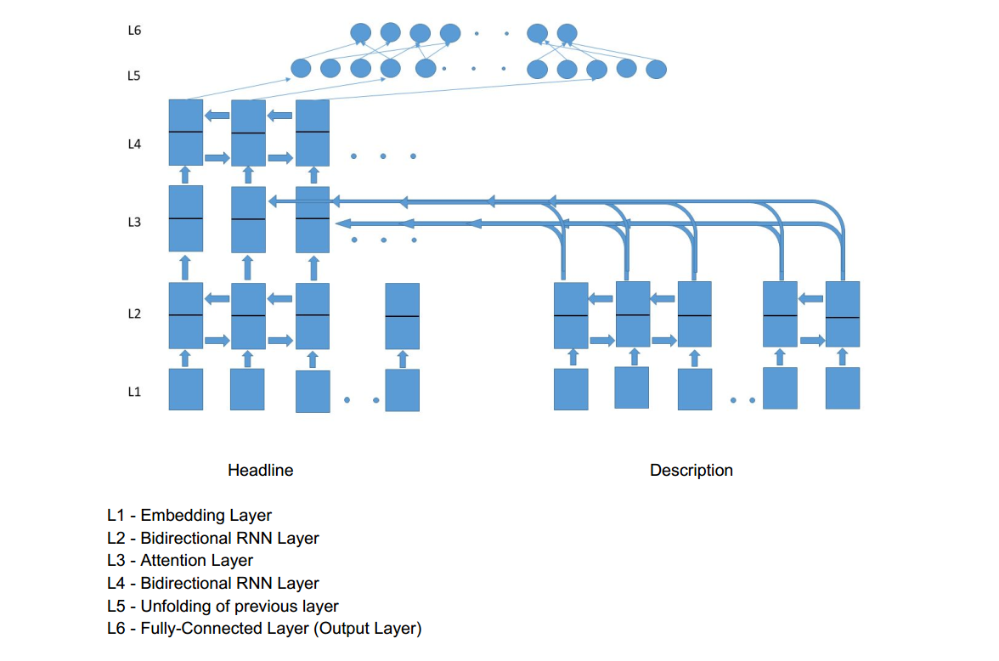
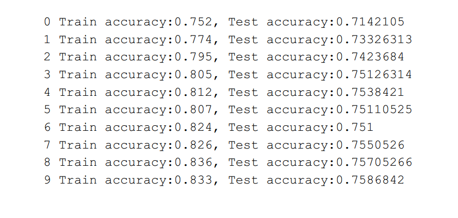

# News-category-classifier

A Bidirectional LSTM and Attention model capable of detecting News categories.

* This model is trained to generalize a set of not-yet annotated News Headlines.
* This model can guess the correct News Headline category of data not necessarily belonging to the same source of the News Headlines dataset.

## Prerequisites

* [Tensorflow](https://www.tensorflow.org/)
* [Python](https://www.python.org/)

## Running
```
python3 headline_category.py
```

## Dataset

A News dataset consists of following attributes.
* **id** - *ID of the News Headline*
* **category** - *Category of the News Headline*
* **headline** - *The News headline*
* **short_description** - *Short description of the News Article*

Dataset can be downloaded [here](https://www.kaggle.com/rmisra/news-category-dataset#News_Category_Dataset_v2.json).

## Architecture


## Preprocessing steps:

1. Removal of punctuations.
2. Tokenization.

* [json_embedding_news.json](./json_embedding_news.json) file is created to store dictionary of GloVe embeddings for words in headline and short_description.

* [dataset_final.txt](./dataset_final.txt) file is the final input to the model, each line in it is of the form:
```
"headline" + "\t" + "short_description" + "category_index" + "\n"
```
* [category_index.json](./category_index.json) file contains dictionary to convert category to index vice versa.

## Training


## Built With

* [Colaboratory](https://colab.research.google.com/)

## References
* [Effective Approaches to Attention-based Neural Machine Translation](https://nlp.stanford.edu/pubs/emnlp15_attn.pdf)
* [Bi-Directional Attention Flow For Machine Comprehension](https://arxiv.org/pdf/1611.01603.pdf)
* For more details on the model, please follow this [blog](https://medium.com/@vishwajeetkumar_85368/news-classification-using-bidirectional-lstm-and-attention-a67aa803ca74).
## Authors

*  [Vishwajeet Kumar](https://github.com/vishwajeetkr)
*  [Atul Kumar](https://github.com/atkatul)
*  [Akash Meshram](https://github.com/akashmeshram)

## License

This project is licensed under the MIT License - see the [LICENSE](./LICENSE) file for details
